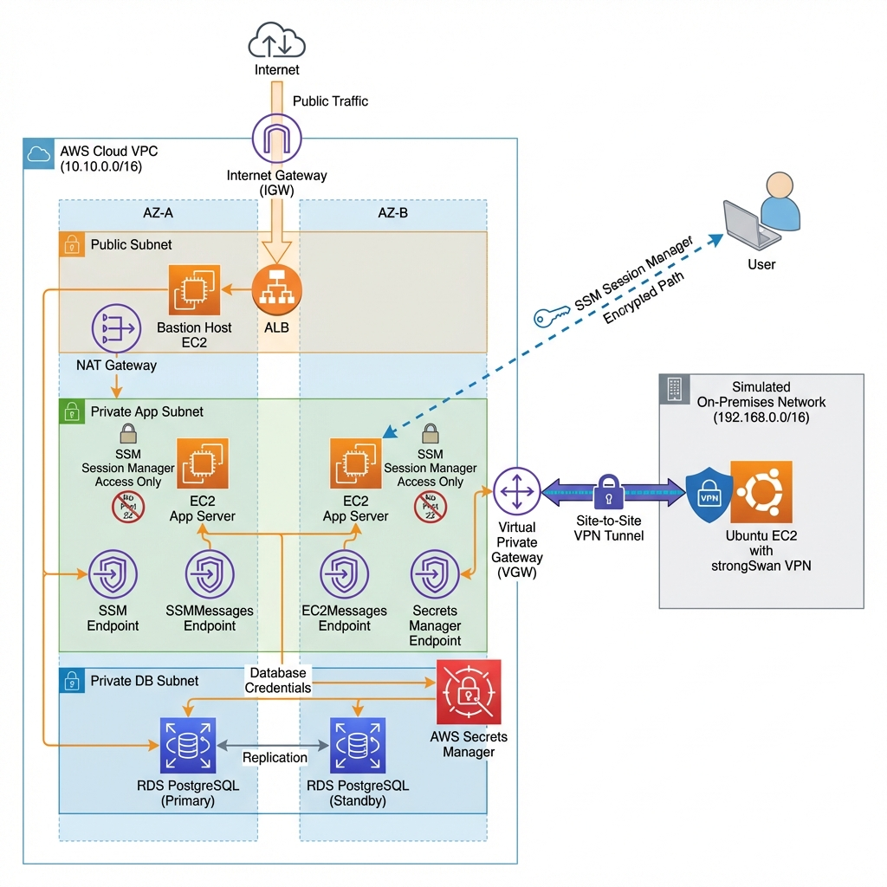

# System Architecture

This document describes the high-level architecture of the Secure Hybrid 3-Tier Web Application.

## Architecture Diagram
The following diagram illustrates the secure hybrid 3-tier setup with SSM Session Manager and AWS Secrets Manager integration.

## Component Breakdown

### 1. AWS Cloud VPC (10.10.0.0/16)
- **Public Tier:** Houses the Application Load Balancer (ALB). The ALB handles incoming HTTP traffic from the internet and distributes it to the private application instances.
- **Private App Tier:** Contains EC2 instances running the web application. Access is restricted to SSM Session Manager (no SSH/Port 22) for maximum security.
- **Private DB Tier:** An isolated RDS PostgreSQL instance.

### 2. Security & Management
- **AWS Systems Manager (SSM):** Used for secure, auditable access to private ec2 instances without needing an SSH gateway or opening public ports.
- **AWS Secrets Manager:** Securely stores and rotates database credentials. The RDS instance and App servers retrieve these credentials dynamically.
- **VPC Endpoints:** Interface endpoints allow private traffic within the VPC to reach AWS services without crossing the public internet. The three required for SSM are:
    - **`ssm`**: The main control plane for heartbeat signals and configuration.
    - **`ssmmessages`**: Required for interactive **Session Manager** shells (terminal data).
    - **`ec2messages`**: Used for AWS-to-instance messaging (e.g., Run Command).
    - **`secretsmanager`**: Private access to retrieve database credentials.

### 3. Identity and Access Management (IAM)
IAM is the "security guard" of the architecture, ensuring that resources have only the specific permissions they need (Principle of Least Privilege).
- **`AppInstanceRole`**: An IAM Role assigned to the App EC2 instances. It contains two critical permission sets:
    - **SSM Core Permissions**: Allows the instance to communicate with the Systems Manager service for interactive sessions (replaces SSH).
    - **Secrets Access**: A custom policy that specifically allows the instance to "Read" the database password from Secrets Manager.
- **Instance Profile**: The bridge that allows the EC2 instances to "assume" the IAM Role at runtime without needing manual credentials.

### 4. Hybrid Connectivity
- **Site-to-Site VPN:** Connects the AWS Virtual Private Gateway (VGW) to the on-premises Customer Gateway (CGW) via an encrypted IPsec tunnel.
- **Simulated On-Premises:** A separate VPC simulating a corporate data center with an Ubuntu instance acting as the network gateway.
